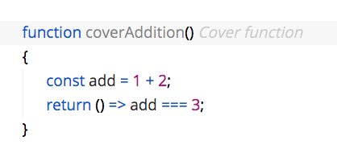

# Moduless

This is a Visual Studio Code extension designed to support a module-free, bundler-free workflow.

## Installation

The extension is not on the marketplace, so you'll need to have the `vsce` tool installed globally in order to build this. Install it with:

```
npm install vsce -g
```

Once VSCE is installed, you need to package this project in order to create a `.vsix` file which will be loaded manually into VS Code. Do this by running the following command from root folder of this project (the which is the `/Moduless` folder in this repo):

```
vsce package
```

This will create a file named like `moduless-?.?.?.vsix`. This file then needs to be installed manually in VS Code. This done from the command line, with the following command:

```
code --install-extension moduless-?.?.?.vsix
```

If you're running the insiders build of VS Code, the command is:

```
code-insiders --install-extension moduless-?.?.?.vsix
```

This requires the Shell integration to be installed. On macOS, this is done by running the command from VS Code: `Shell Command: Install 'code' command in PATH`.

## Usage

Moduless debugging works differently from standard debugging. Instead of running the standard VS Code debugging command, the Moduless extension provides it's own command to start a debugging session. The command names are `moduless.start` and `moduless.stop`, and the hotkeys default to `F5`, but this can be configured.

Moduless dispenses with the idea of `launch.json`. Instead, launch configurations are generated automatically by analyzing the project structure.

## Detecting "Cover" Functions

Moduless refers to test functions as "cover" functions. Cover functions are regular JavaScript functions that start with the name "cover". This way, your test files  look as clean as like:

```
namespace MyProject
{
	function coverAddition()
	{
		const add = 1 + 2;
		return () => add === 3;
	}
}
```

Cover functions are expected to return a parameterless arrow function (or an array of these), which are executed in order to determine if the cover passes or fails. The formatting of this arrow function is significant–Moduless uses `Function.toString()` on the back end to turn this code into a visual report about what passed and failed.

Moduless will automatically detect cover functions in your `outFile`, and populate the test view in VS Code. Clicking on one of these tests in the test view will cause it to be run automatically. Additionally, the Moduless extension automatically detects these functions within your source code, and highlights them:


